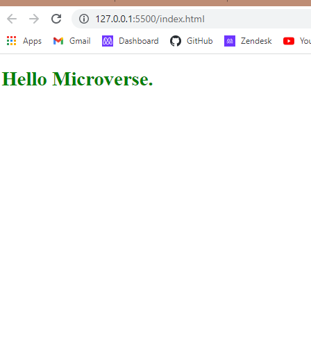

# Hello Microverse

> It is my first project in microverse. In this project I Created has a new GitHub repo named it Hello-World, and a new branch according to the GitHub flow with one .gitignore file.

the Above image is the screen shot of the project.

## Built With

- Html/CSS

## Getting Started

It is my first project in microverse. In this project I Created has a new GitHub repo named it Hello-World, and a new branch according to the GitHub flow with one .gitignore file.

## Authors

👤 Nizamuddin Ahmadzai

- GitHub: [@Nizamuddin4493](https://github.com/Nizamuddin4493)
- Twitter: [@Nizamuddin4493](https://twitter.com/Nizamuddin4493)
- LinkedIn: [nizam-udd-in-ahmadzai](https://www.linkedin.com/in/nizam-ud-din-ahmadzai-793269147/)

## 🤝 Contributing

Any type of contribution will be appreciated.

Feel free to check the [issues page](../../issues/).

## Show your support

Give a ⭐️ if you like this project!

## Acknowledgments

- Self coded no code was copied from any resource.

## 📝 License

This project is ISC licensed.
